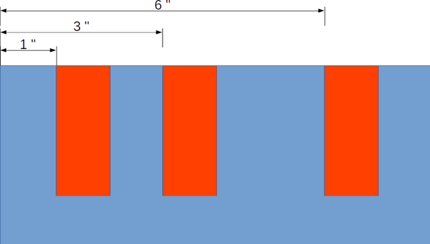

# Codenrock New Year Code Battle
Решение 15 задач на алгоритмы по мотивам IT сериалов в рамках соревнования: "Codenrock New Year Code Battle".  
<https://codenrock.com/contests/codenrock-new-year-code-battle/>

1. [Алфавит](#алфавит)
2. [Война](#война)
3. [Взлом двери](#взлом-двери)
4. [Наивный RLE](#наивный-rle)
5. [Имя Фамилия](#имя-фамилия)
6. [GAME OVER](#game-over)

## Алфавит
### Задание
Зашифруйте сообщение меняя буквы на их порядковый номер в алфавите. Пробелы при этом не учитывать. Строки будут даны без знаков препинания, только с пробелами. Регистр не учитывать.  

**Входные данные:** шифруемая строка, длиной до 1000 символов, на латинице  
**Пример входных данных:** MR Robot  
**Выходные данные:** через запятую порядковый номер букв в алфавите  
**Пример выходных данных:** 13,18,18,15,2,15,20  

### Код (alphabet.py)
```python
import sys
import string

alphabet = string.ascii_lowercase  # latin alphabet

def encode(line):
    line = line.replace(" ", "").rstrip('\n')
    ind_list = [alphabet.find(x) + 1 for x in line.lower()]
    print(','.join(map(str, ind_list)))

if __name__ == '__main__':
    for line in sys.stdin:  # get input strings one by one
        encode(line)
```
## Война
### Задание
В мире Дикого запада идет война. Главнокомандующие разработали стратегию клина, чтобы сбить ряды противника. Чтобы образовать клин надо знать число человек в ряду противника, т.к. в задней части клина количество участников равно количеству человек в ряду у противника. В каждом ряду клина на два участника меньше, чем в предыдущем ряду. На острой части клина может быть либо 2 либо 1 участник. Так если в ряду у противника 9 человек, то ряды клина состоят из такого количества человек: 9 7 5 3 1. Или для 6 человек в ряду у противника: 6 4 2. По введенному числу количества человек в ряду у противника, найдите количество человек в клину. Количество человек у противника может достигать 100.  


**Пример входных данных:** 9  
**Пример выходных данных:** 25  

### Код (warfare.py)
```python
import sys
import math

def sum_of_arithmetic_progression(a1, d, n):
    return (2*a1 + d*(n - 1))*n/2

def warfare(line):
    opponents = float(line)
    n = math.ceil(opponents/2) # round up
    S = sum_of_arithmetic_progression(opponents, -2, n)
    print(int(S)) # print the answer to stdout

if __name__ == '__main__':
    for line in sys.stdin: # get input strings one by one
        warfare(line)
```
## Взлом двери
### Задание
Дарлин взламывает тумбочку в квартире Эллиота. Замочна скважина устроена из барьеров, которые не позволяют сдвинуть замок и соответствуют прорезям на ключе. Когда ключ поворачивается, он поворачивает то пространство где нет барьеров. На картинке барьеры показаны красным цветом. Дарлин замерила расстояние от входа в замочную скважину, до начала каждого барьера, они равны целым числам. Чтобы взломать замок, достаточно вставить в каждый промежуток между барьерами,а так же до первого барьера и после последнего палочки диаметром 1 и повернуть их одновременно.  
Расстояние между барьерами во входных данных не может быть меньше чем 1. Каждый барьер толщиной 1. Барьеров может быть от 1 до 3. Ваша задача вывести модель самодельного ключа Дарлин, где каждая палочка будет надета на основу, равную длине замка, каждая палочка высотой 3, в каждом промежутке между барьерами каждая палочка будет ближе к правой стороне.



**Входные данные:** расстояния от начала замочной скважины, до каждого барьера, и общая длина замочной скважины  
**Пример входных данных:** 1,3,6,8  
**Выходные данные:** нарисованная модель ключа Дарлин, где X - ключ, 0 - пустое пространство.  
**Пример выходных данных (для замка с картинки):**  
X0X00X0X  
X0X00X0X  
X0X00X0X  
XXXXXXXX  

### Код (hacking_door.py)
```python
import sys

def hacking_door(line):
    res = list(filter(lambda x : x.isdigit(), line.split(",")))
    sticks = [int(x) for x in res[:-1]]
    length = int(res[len(res) - 1])
    key = []
    for i in range(length):
        if (i+1 in sticks or i+1 == length):
            key.append('X')
        else:
            key.append('0')
    for i in range(3):
        print(*[x for x in key], sep='')
    print(*['X' for x in range(length)], sep='')

if __name__ == '__main__':
    for line in sys.stdin:
        hacking_door(line)
```
## Наивный RLE
### Задание
RLE - самый простой алгоритм сжатия. Его суть состоит в замене повторяющихся данных образцом, и количеством повтора образца. Алгоритм подходит для сжатия данных, имеющих большое количество повторений. Напишите программу, которая реализует RLE для строк, состоящих из букв латинского алфавита, не имеющих пробелы. При сжатии учитывайте регистр. Во входных данных только одна строка. 

**Например:** DDDDFFFFHHHHk → 4D,4F,4H,1k

### Код (simple_rle.py)
```python
import sys

def encode_message(message):
    encoded_string = ""
    i = 0
    while (i < len(message)):
        count = 1
        ch = message[i]
        while (i < len(message)-1): 
            if (message[i] == message[i + 1]): 
                count += 1
                i += 1
            else: 
                break
        encoded_string += str(count) + ch + ','
        i += 1
    return encoded_string[:-1]

if __name__ == '__main__':
    for line in sys.stdin:
        print(encode_message(line[:-1]))
```
## Имя Фамилия
### Задание
Эллиот хочет получить все имена и фамилии из текста. Для этого он находит все пары слов, которые идут друг за другом и начинаются с заглавной буквы. Напишите программу способную это сделать. Если между двумя подходящими словами стоит любой знак кроме пробела, то эту пару слов не считать Именем Фамилией, но могут встречаться повторяющиеся пробелы, в таком случае подходящая пара остается Именем и Фамилией. Входные данные представлены на русском языке и исключают возможность появления трех и более слов, удовлетворяющих условию поиска, подряд. Имя и фамилию ищите на русском языке. Текст длиной не более 2000 символов. 

**Пример входных данных:** “В качестве выкупа fsociety вынуждает Скотта Ноулза надеть маску fsociety и публично сжечь 5,9 миллиона долларов полученных от взлома. Анджела Мосс продолжает подниматься по карьерной лестнице в E Corp, по-видимому, довольная своей новой корпоративной позицией, и, похоже, отказывается от иска. Джоанна получает подарок на пороге - музыкальную шкатулку со спрятанным под ней телефоном, но пропускает звонок. Эллиот обнаруживает, что действовал под влиянием Мистера Робота, когда думал, что спит. Человек по имени Брок убивает Гидеона, который ранее угрожал сообщить о подозрительном поведении Эллиота в Олсейф ФБР и агенту Доминик ДиПьерро. Эллиот просыпается от диссоциативного состояния, разговаривая по телефону, его приветствует на другом конце провода Тайрелл.”  
**Пример выходных данных:** “Скотта Ноулза, Анджела Мосс, Мистера Робота, Олсейф ФБР, Доминик ДиПьерро”

### Код (name_search.py)
```python
import sys
import re 

def name_search(text):
    return re.findall(r'[А-Я][А-Яа-я]+\s+[А-Я][А-Яа-я]+', text)

if __name__ == '__main__':
    for line in sys.stdin:
        print(*[x for x in name_search(line)], sep=', ')
```
## GAME OVER
### Задание
Бернард смотрит, что происходит в парке в разные моменты времени. Он хочет знать в каком состоянии находились машины в нужное ему время. Они находятся в двух состояниях: либо они играют (GAME CONTINUES), либо они находятся на починке (GAME OVER). Вам будут даны интервалы времени, когда роботы находились на починке, и время, которое интересовало Бернарда. Бернард смотрит данные за последний месяц, поэтому он вводит число и время, например, 2-е число 15 часов 13 минут: 2 15:13. Кол-во роботов не превышает 10, кол-во дат в запросе не больше 10. Время ремонта робота включает в себя границы заданных промежутков времени.  

**Входные данные:** Сначала идет список роботов (R) в виде: Имя | даты поломки через запятую в формате "DD HH:MM"  
                    Далее идёт список времени (T), которое интересовало Бернарда в формате "DD HH:MM"  
**Пример входных данных:**  
R:Тедди| 4 18:12 - 6 19:32, 17 13:12 - 20 14:42   
R:Долорес| 12 14:12 - 12 18:15   
R:Мейв| 13 9:21 - 13 21:23, 14 7:23 - 15 12:12 , 17 18:00 - 19 23:22, 22 20:25 - 26 15:14   
R:Питер| 8 9:05 - 10 4:55   
R:Клементина| 15 4:00 - 16 14:43   
T:8 14:21  
T:17 19:17  
**Выходные данные:** дата, состояния роботов  
**Пример выходных данных:**  
8 14:21  
Тедди GAME CONTINUES  
Долорес GAME CONTINUES  
Мейв GAME CONTINUES  
Питер GAME OVER  
Клементина GAME CONTINUES  
17 19:17  
Тедди GAME OVER  
Долорес GAME CONTINUES  
Мейв GAME OVER  
Питер GAME CONTINUES  
Клементина GAME CONTINUES  

### Код (game_over.py)
```python
import sys
import re 

def parsing_R(line):
    name = re.search(r'[А-Яа-я]+', line)
    days = [int(x) for x in re.findall(r' \d+ ', line)]
    hours = [int(x[:-1]) for x in re.findall(r' \d+:', line)]
    minutes = [int(x[1:]) for x in re.findall(r':\d+', line)]
    return name[0], days, hours, minutes

def parsing_T(line):
    day = int(re.search(r'^\d+ ', line)[0])
    hour = int(re.search(r' \d+:', line)[0][:-1])
    minute = int(re.search(r':\d+', line)[0][1:])
    return day, hour, minute

def search(robots, periods): 
    for i in range(len(periods)):
        print(f"{periods[i][0]} {periods[i][1]}:{periods[i][2]}")
        for j in range(len(robots)):
            game = True
            for k in range(0, len(robots[j][1]), 2):
                if periods[i][0] > robots[j][1][k] and periods[i][0] < robots[j][1][k+1]:
                    game = False
                elif periods[i][0] == robots[j][1][k]:
                    if periods[i][1] > robots[j][2][k]:
                        game = False
                    elif periods[i][1] == robots[j][2][k]:
                        if periods[i][2] >= robots[j][3][k]:
                            game = False
                elif periods[i][0] == robots[j][1][k+1]:
                    if periods[i][1] < robots[j][2][k+1]:
                        game = False
                    elif periods[i][1] == robots[j][2][k+1]:
                        if periods[i][2] <= robots[j][3][k+1]:
                            game = False
            if game:
                print(f"{robots[j][0]} GAME CONTINUES")
            else:
                print(f"{robots[j][0]} GAME OVER")

if __name__ == '__main__':
    robots = []
    periods = []
    for line in sys.stdin: 
        if (line[0] == 'R'):
            robots.append(parsing_R(line[2:]))
        elif (line[0] == 'T'):
            periods.append(parsing_T(line[2:]))
        elif (line[0] == '0'): 
            search(robots, periods)
```
